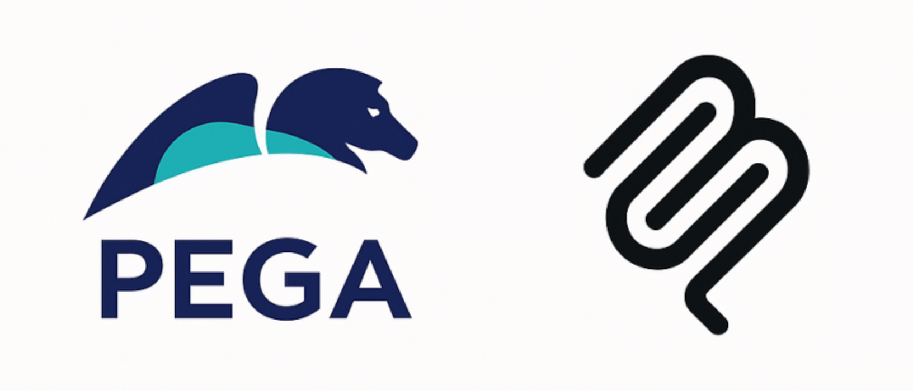

# Pega DX MCP Server

**Official Model Context Protocol server for Pega Digital Experience APIs**

[](LICENSE)
[](https://nodejs.org/)
[](https://modelcontextprotocol.io/)
[](https://www.pega.com/)

[Guru changes please ignore] Transform complex Pega Platform interactions into intuitive, conversational experiences by exposing Pega DX APIs through the standardized Model Context Protocol. Enable AI applications, IDEs, and development tools to interact with Pega through natural language.

---

## 🌟 Key Features

- **🤖 Natural Language Interface** - "Create a travel claim for John" → Automated case creation
- **🔌 Plug-and-Play Integration** - Compatible with Claude, IDEs, and MCP-enabled tools
- **🏢 Enterprise Grade** - Production-ready with comprehensive error handling and audit logging
- **📡 Complete API Coverage** - Access to cases, assignments, attachments, and data operations
- **⚡ High Performance** - Intelligent caching and optimization for responsive interactions
- **🛡️ Secure** - OAuth 2.1 with PKCE and role-based access control

## 🚀 Quick Start

### Prerequisites

- Node.js 20+ and npm
- Access to Pega Platform (8.8+) with DX API enabled
- OAuth 2.1 client credentials

### Installation

```bash
# Clone the repository
git clone https://github.com/pegasystems/pega-dx-mcp.git
cd pega-dx-mcp

# Install dependencies
npm install

# Configure environment
cp .env.example .env
# Edit .env with your Pega Platform details

# Start the MCP server
npm start
```

### Integration with Claude Desktop

Add to your Claude Desktop MCP configuration:

```json
{
  "mcpServers": {
    "pega-dx": {
      "command": "node",
      "args": ["/path/to/pega-dx-mcp/src/index.js"],
      "env": {
        "PEGA_BASE_URL": "https://your-pega-instance.com",
        "PEGA_CLIENT_ID": "your-client-id",
        "PEGA_CLIENT_SECRET": "your-client-secret"
      }
    }
  }
}
```

## 🏗️ Architecture

The Pega DX MCP Server bridges AI applications with Pega Platform using the Model Context Protocol:


## 🛠️ Available Tools

### Case Management

| Tool                   | Description                   | Example Usage                                   |
| ---------------------- | ----------------------------- | ----------------------------------------------- |
| `pega_case_types_list` | List available case types     | "What case types are available?"                |
| `pega_case_types_get`  | Get case type details         | "What fields are required for travel requests?" |
| `pega_cases_create`    | Create new cases              | "Create a travel claim for John to New York"    |
| `pega_cases_list`      | List cases with filtering     | "Show me all open insurance claims"             |
| `pega_cases_get`       | Get detailed case information | "Show me details for case TRAVEL-001"           |

### Assignment Management

| Tool                       | Description                   | Example Usage                 |
| -------------------------- | ----------------------------- | ----------------------------- |
| `pega_assignments_next`    | Get next available assignment | "What's my next task?"        |
| `pega_assignments_list`    | List user assignments         | "Show my pending assignments" |
| `pega_assignments_execute` | Execute assignment actions    | "Approve the travel request"  |

## 💬 Usage Examples

### Creating a Case

```
User: "Create a new insurance claim for policy #12345"
AI: I'll create a new insurance claim case. What type of claim is this?
User: "Auto accident claim"
AI: ✅ Created auto accident claim case INS-CLAIM-789
    Case ID: INS-CLAIM-789
    Policy: #12345
    Status: Open
    Next step: Provide accident details
```

### Managing Assignments

```
User: "What's my next assignment?"
AI: You have 3 pending assignments:
    1. Review claim documentation (INS-CLAIM-789) - Due today
    2. Approve travel request (TRAVEL-456) - Due tomorrow
    3. Customer callback (SERVICE-123) - Due in 2 hours
User: "Let me work on the claim review"
AI: ✅ Opening claim documentation review for INS-CLAIM-789
    [Displays relevant case data and required actions]
```

## ⚙️ Configuration

### Environment Variables

```bash
# Pega Platform Connection
PEGA_BASE_URL=https://your-pega-instance.com
PEGA_API_VERSION=v2

# OAuth 2.1 Authentication
PEGA_CLIENT_ID=your-oauth-client-id
PEGA_CLIENT_SECRET=your-oauth-client-secret
PEGA_SCOPE=api

# Server Configuration
LOG_LEVEL=info
CACHE_TTL=300000
REQUEST_TIMEOUT=30000
```

### OAuth Setup

1. **Register OAuth Client** in your Pega Platform
2. **Configure Scopes** for API access
3. **Set Redirect URIs** if using authorization code flow
4. **Update Environment** with client credentials

For detailed setup instructions, see our [Configuration Guide](docs/configuration.md).

## 🤝 Contributing

We welcome contributions from the community! Here's how you can help:

### Ways to Contribute

- 🐛 **Report Issues** - Found a bug? Let us know!
- 💡 **Feature Requests** - Have an idea? We'd love to hear it!
- 🔧 **Code Contributions** - Submit pull requests for fixes and features
- 📖 **Documentation** - Help improve our docs and examples
- 🧪 **Testing** - Add test cases and improve coverage

### Development Setup

```bash
# Fork and clone the repository
git clone https://github.com/your-username/pega-dx-mcp.git
cd pega-dx-mcp

# Install dependencies
npm install

# Create a feature branch
git checkout -b feature/your-feature-name

# Make changes and test
npm test

# Submit pull request
```

### Guidelines

- Follow our [Code of Conduct](CODE_OF_CONDUCT.md)
- Ensure tests pass and add new tests for features
- Update documentation for any API changes
- Use conventional commit messages

## 📄 License

Licensed under the Apache License, Version 2.0. See [LICENSE](LICENSE) for details.

---

<div align="center">

**Built with ❤️ by Pegasystems**

[Website](https://www.pega.com) • [Community](https://community.pega.com) • [Documentation](https://docs.pega.com)

</div>
