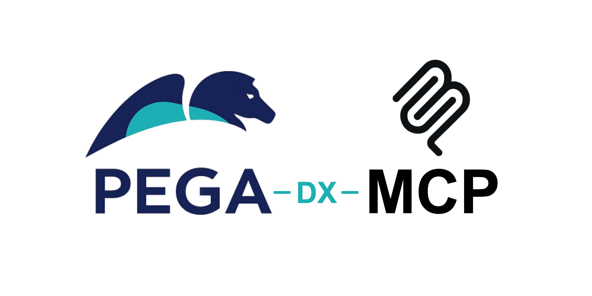
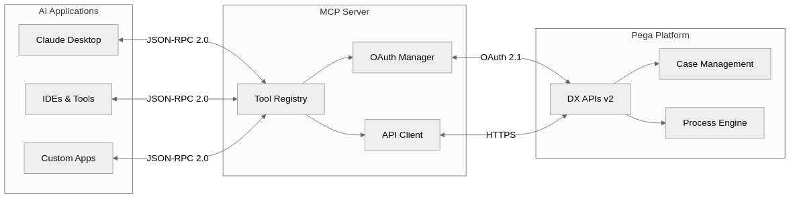

# Pega DX MCP Server

[](LICENSE)
[](https://nodejs.org/)
[](https://modelcontextprotocol.io/)
[](https://www.pega.com/)

## Enabling conversational interaction with Pega Infinity&trade; Applications

This package transforms Pega Infinity&trade; interactions into intuitive, conversational experiences through the Model Context Protocol. By bridging Pega DX APIs with natural language interfaces, it enables GenAI Agents, IDEs, and other MCP-enabled tools to interact with Pega Infinity&trade; applications using simple, human-readable commands.

## 🧪 Experimental

The Pega DX MCP Server is an experimental project exploring the intersection of Model Context Protocol and Pega Infinity&trade; capabilities. This is not an official Pegasystems product and is not generally available. All commands, parameters, and other features are subject to change or deprecation at any time, with or without notice. Do not use this MCP server for production functionality. This experiment demonstrates the potential of natural language interfaces for Pega Infinity&trade; interactions. We welcome feedback and contributions to help shape the future of GenAI-powered business automation.

## 🌟 Key Features

- **🤖 Natural Language Interface** - Demonstrates conversational case creation: "Create a travel claim for John"
- **🔌 Plug-and-Play Integration** - Experimental compatibility with GenAI Agents, IDEs, and MCP-enabled tools
- **🧪 Innovation Prototype** - Exploring enterprise-grade patterns with comprehensive error handling approaches
- **📡 API Integration Exploration** - Investigating access to cases, assignments, attachments, and data operations
- **⚡ Performance Research** - Experimenting with intelligent caching and optimization strategies
- **🛡️ Security Framework** - Implementing OAuth 2.1 with PKCE and role-based access control patterns

## 🚀 Quick Start

### Prerequisites

- Node.js (22+) and npm
- Access to Pega Infinity&trade; (23+) with DX API enabled
- OAuth 2.1 client credentials

### Installation

```bash
# Install from npm (recommended)
npm install -g @pega-enablement/pega-dx-mcp
```

### Integration with MCP Clients

Compatible with Claude Desktop, Cursor, Cline, and other MCP-enabled applications. Add to your MCP client's configuration file:

```json
{
  "mcpServers": {
    "pega-dx-mcp": {
      "command": "npx",
      "args": ["-y", "@pega-enablement/pega-dx-mcp"],
      "env": {
        "PEGA_BASE_URL": "https://your-pega-instance.com",
        "PEGA_CLIENT_ID": "your-client-id",
        "PEGA_CLIENT_SECRET": "your-client-secret"
      }
    }
  }
}
```

**Configuration file locations:**
- **Claude Desktop**: `~/Library/Application Support/Claude/claude_desktop_config.json` (macOS) or `%APPDATA%/Claude/claude_desktop_config.json` (Windows)
- **Cursor**: `.cursor/mcp.json` in your project root
- **Cline**: MCP settings in VS Code

**Verify installation:** Restart your MCP client and confirm the Pega DX tools are available.

## 🏗️ Architecture

The Pega DX MCP Server bridges GenAI applications with Pega Infinity using the Model Context Protocol:



## 🛠️ Available Tools

The Pega DX MCP Server provides **61 comprehensive tools** organized into 11 functional categories. Each category can be enabled or disabled via environment variables for granular control.

### 🔧 Tool Configuration

Control which tool categories are loaded using environment variables. All categories are enabled by default - set to `'false'` to disable:

```bash
# Enable/disable entire tool categories
PEGA_ASSIGNMENT_TOOLS=true         # Assignment operations (9 tools)
PEGA_ATTACHMENT_TOOLS=true         # File and attachment management (7 tools)
PEGA_CASE_TOOLS=true               # Case lifecycle management (16 tools)
PEGA_CASETYPE_TOOLS=true           # Case type information (3 tools)
PEGA_DATAVIEW_TOOLS=true           # Data view operations (7 tools)
PEGA_DOCUMENT_TOOLS=true           # Document operations (2 tools)
PEGA_FOLLOWER_TOOLS=true           # Case follower management (3 tools)
PEGA_PARTICIPANT_TOOLS=true        # Case participant management (7 tools)
PEGA_RELATED_CASE_TOOLS=true       # Related case operations (3 tools)
PEGA_SERVICE_TOOLS=true            # Service connectivity (1 tool)
PEGA_TAG_TOOLS=true                # Case tagging operations (3 tools)
```

### 📋 Complete Tool Inventory

#### Assignment Tools (9)
- `get_assignment` - Get detailed assignment information
- `get_assignment_action` - Get assignment action details and UI metadata
- `get_next_assignment` - Get next work assignment for user
- `jump_to_step` - Navigate to specific step in assignment flow
- `navigate_assignment_previous` - Navigate to previous step in assignment
- `perform_assignment_action` - Execute assignment actions
- `recalculate_assignment_fields` - Recalculate assignment form fields
- `refresh_assignment_action` - Refresh assignment action form data
- `save_assignment_action` - Save assignment form data without executing

#### Attachment Tools (7)
- `add_case_attachments` - Attach files/URLs to cases
- `delete_attachment` - Remove attachments from cases
- `get_attachment` - Retrieve attachment content
- `get_attachment_categories` - List available attachment categories
- `get_case_attachments` - List all case attachments
- `update_attachment` - Update attachment metadata
- `upload_attachment` - Upload files as temporary attachments

#### Case Tools (16)
- `add_optional_process` - Add stage or case-wide optional processes
- `bulk_cases_patch` - Perform actions on multiple cases
- `change_to_next_stage` - Navigate case to next stage
- `change_to_stage` - Navigate case to specific stage
- `create_case` - Create new cases with content
- `delete_case` - Delete cases in create stage
- `get_case` - Retrieve detailed case information
- `get_case_action` - Get case action details and metadata
- `get_case_ancestors` - Get case ancestor hierarchy
- `get_case_descendants` - Get case descendant hierarchy
- `get_case_stages` - List case stages and processes
- `get_case_view` - Get specific case view details
- `get_case_view_calculated_fields` - Calculate case view fields
- `perform_bulk_action` - Execute bulk case operations
- `perform_case_action` - Execute case-wide actions
- `recalculate_case_action_fields` - Recalculate case action fields
- `refresh_case_action` - Refresh case action form data
- `release_case_lock` - Release pessimistic case locks

#### Case Type Tools (3)
- `get_case_type_action` - Get case type action metadata
- `get_case_type_bulk_action` - Get bulk action metadata for case types
- `get_case_types` - List available case types

#### Data View Tools (7)
- `delete_data_record` - Delete data records from savable data pages
- `get_data_objects` - List available data objects
- `get_data_view_count` - Get data view result counts
- `get_data_view_metadata` - Get data view metadata and parameters
- `get_list_data_view` - Query list data views with filtering
- `update_data_record_full` - Fully update data records
- `update_data_record_partial` - Partially update data records

#### Document Tools (2)
- `get_document` - Retrieve document content as base64
- `remove_case_document` - Remove documents linked to cases

#### Follower Tools (3)
- `add_case_followers` - Add users as case followers
- `delete_case_follower` - Remove case followers
- `get_case_followers` - List case followers

#### Participant Tools (7)
- `create_case_participant` - Add participants to cases
- `delete_participant` - Remove case participants
- `get_case_participants` - List all case participants
- `get_participant` - Get specific participant details
- `get_participant_role_details` - Get participant role information
- `get_participant_roles` - List available participant roles
- `update_participant` - Update participant information

#### Related Case Tools (3)
- `delete_related_case` - Remove case relationships
- `get_related_cases` - List related cases
- `relate_cases` - Create case relationships

#### Service Tools (1)
- `ping_pega_service` - Test OAuth2 connectivity to Pega Platform

#### Tag Tools (3)
- `add_case_tags` - Add tags to cases
- `delete_case_tag` - Remove specific case tags
- `get_case_tags` - List case tags

## 💬 Usage Examples

> **Note**: The following examples demonstrate envisioned capabilities and planned user experiences. These scenarios represent the experimental goals of this GenAI Innovation project and may not reflect current implementation status.

### Creating a Case

```
User: "Create a new insurance claim for policy #12345"
AI: I'll create a new insurance claim case. What type of claim is this?
User: "Auto accident claim"
AI: ✅ Created auto accident claim case INS-CLAIM-789
    Case ID: INS-CLAIM-789
    Policy: #12345
    Status: Open
    Next step: Provide accident details
```

### Managing Assignments

```
User: "What's my next assignment?"
AI: You have 3 pending assignments:
    1. Review claim documentation (INS-CLAIM-789) - Due today
    2. Approve travel request (TRAVEL-456) - Due tomorrow
    3. Customer callback (SERVICE-123) - Due in 2 hours
User: "Let me work on the claim review"
AI: ✅ Opening claim documentation review for INS-CLAIM-789
    [Displays relevant case data and required actions]
```

## ⚙️ Configuration

### Environment Variables

```bash
# Pega Infinity Connection
PEGA_BASE_URL=https://your-pega-instance.com

# OAuth 2.1 Authentication
PEGA_CLIENT_ID=your-oauth-client-id
PEGA_CLIENT_SECRET=your-oauth-client-secret
```

### OAuth Setup

1. **Register OAuth Client** in your Pega Platform
2. **Configure Scopes** for API access
3. **Set Redirect URIs** if using authorization code flow
4. **Update Environment** with client credentials

For detailed setup instructions, see our [Configuration Guide](docs/configuration.md).

## 🤝 Contributing

Join us in this exciting GenAI Innovation experiment! As an experimental project exploring the future of natural language interfaces for enterprise platforms, we welcome community participation in shaping this innovation journey.

### Ways to Contribute

- 🔬 **Experiment Feedback** - Share your experiences and insights from testing the prototype
- 💡 **Innovation Ideas** - Contribute to the GenAI Innovation roadmap with creative suggestions
- 🐛 **Issue Reports** - Help identify challenges in this experimental project
- 🔧 **Code Contributions** - Contribute to the codebase and proof-of-concept features
- 📖 **Documentation** - Help document learnings and experimental outcomes
- 🧪 **Testing & Validation** - Participate in testing new experimental capabilities

### Development Setup

```bash
# Fork and clone the repository
git clone https://github.com/your-username/pega-dx-mcp.git
cd pega-dx-mcp

# Install dependencies
npm install

# Create a feature branch
git checkout -b feature/your-feature-name

# Make changes and test
npm test

# Submit pull request
```

### Guidelines

- Follow our [Code of Conduct](CODE_OF_CONDUCT.md)
- Ensure tests pass and add new tests for features
- Update documentation for any API changes
- Use conventional commit messages

## 📄 License

Licensed under the Apache License, Version 2.0. See [LICENSE](LICENSE) for details.

---

<div align="center">

**Built with ❤️ by Pega Enablement**

[Community](https://community.pega.com) • [Academy](https://academy.pega.com) •  [Documentation](https://docs.pega.com)

</div>
